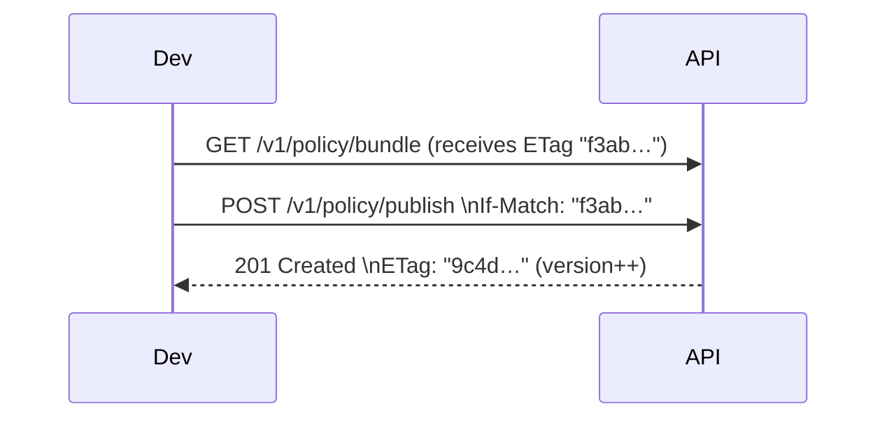

# D2 Cloud Control-Plane – Developer Guide

Welcome to **D2 Cloud**, the serverless control-plane that powers the `d2-python` SDK. This document is a guided tour of the FastAPI code-base hosted in the `app/` package: every route, the data it stores, security controls, Supabase schema, background jobs, and important environment variables.

---
## 1. High-Level Architecture

```
SDK ↔ HTTPS ─────────────┐
                        │
        ┌───────────────┴───────────────┐
        │ Vercel Serverless  Functions │
        │   (FastAPI application)       │
        └───────────────┬───────────────┘
                        │
        Supabase Postgres  ←─┬─→  Logflare → ClickHouse
                             │
        Supabase  Auth (RLS) │
```

* **Runtime**: Vercel Functions (HTTP) + Vercel Cron (background jobs).
* **State**: Supabase (Postgres) – the *only* persistent store.
* **Analytics/Logs**: Raw event batches are streamed to Logflare → ClickHouse for cost-efficient aggregation.
* **Languages/Libraries**: FastAPI | Pydantic | async-supabase | SlowAPI (IP rate limiting) | bcrypt + sha256 | jose | cryptography.

---
## 2. Environment Variables

| Variable | Purpose | Default |
|----------|---------|---------|
| `SUPABASE_URL`, `SUPABASE_KEY` | Connection creds (used by async Supabase client). | – |
| `FRONTEND_ORIGIN` | Allowed CORS origin for the *private* API. | – |
| `LOGFLARE_HTTP_ENDPOINT` / `LOGFLARE_API_KEY` | Ingest endpoint + key. | `https://api.logflare.app` / *unset* |
| `JWK_AES_KEY` | 32-byte base64url key for AES-GCM encryption of private keys at rest. | none (plain-text in dev) |
| `CLICKHOUSE_HTTP_ENDPOINT` / `CLICKHOUSE_USER` / `CLICKHOUSE_PASSWORD` | Destination & credentials for bulk event export (ClickHouse). | – |
| `PRO_POLL_SEC` | Optional override for PRO polling cadence. | 60 (seconds) |
| `PRO_EVENT_BATCH` | Optional SDK-side batching hint. | 1000 (events) |
| `PRO_EVENT_MAX_BYTES` | Optional per-plan event payload limit exposed via `/v1/accounts/me`. | 32768 (bytes) |
| `ENTERPRISE_POLL_SEC` | Optional override for Enterprise polling cadence. | 30 (seconds) |
| `ENTERPRISE_EVENT_BATCH` | Optional SDK-side batching hint. | 5000 (events) |
| `ENTERPRISE_EVENT_MAX_BYTES` | Optional per-plan event payload limit. | 32768 (bytes) |
| `JWK_OVERLAP_DAYS` | Days two key-pairs overlap before pruning. | `7` (days) |

> All cron scripts inherit the same env, so secrets live only in Vercel.

> Per-plan overrides: the API surfaces plan-specific quotas from these env vars (e.g. `PRO_*`, `ENTERPRISE_*`) in `/v1/accounts/me`. If unset, baked-in defaults from `plans.py` are used.

---
## 3. Supabase Schema

| Table | Shape | Notes |
|-------|-------|-------|
| `accounts` | `{ id uuid PK, plan text, metrics_enabled bool, poll_seconds int }` | Owner row for every tenant. |
| `api_tokens` | `{ id uuid PK, token_id text, token_sha256 text, account_id uuid FK, scopes text[], expires_at timestamptz, revoked_at timestamptz }` | **Storage**: `token_sha256` column now holds a *bcrypt hash* of the SHA-256 of the plaintext token. Legacy rows may still contain a raw SHA-256. RLS `account_id = auth.uid()`. |
| `policies` | `{ id uuid PK, account_id uuid, version int DEFAULT 1 NOT NULL, bundle jsonb, jws text, is_draft bool, published_at timestamptz, revocation_time timestamptz }` | Each **publish** auto-increments `version`. Strong ETag & optimistic concurrency prevent lost updates. |
| `jwks_keys` | `{ id uuid PK, account_id uuid, kid uuid, public_jwk jsonb, private_jwk text, created_at timestamptz, expires_at timestamptz }` | `private_jwk` AES-GCM-encrypted when `JWK_AES_KEY` is set. |
| `public_keys` | `{ account_id uuid FK, key_id text PK, algo text, public_key bytea, created_at timestamptz, revoked_at timestamptz }` | Ed25519 public keys used to verify signed bundle uploads. |
| `usage_counters` | `{ account_id uuid, metric text, hour timestamptz, count int, PRIMARY KEY (account_id, metric, hour) }` | Atomic upsert counters for per-plan quotas. |

---
## 4. Route Reference

### 4.1 Public (Unauthenticated) – `app/public`

| Method & Path | Description | Headers |
|---------------|-------------|---------|
| **GET** `https://d2.artoo.love/.well-known/jwks.json` | Returns JSON Web Key Set containing *all* public keys, or filtered by `?account_id=`. | `Cache-Control: public,max-age=300,immutable`  
`Rate-Limit: 60/min` enforced via SlowAPI |

### 4.2 Accounts & Tokens – `accounts_routes.py` / `tokens_routes.py`

| Method & Path | Scope | Payload | Response |
|---------------|-------|---------|----------|
| **GET** `https://d2.artoo.love/v1/accounts/me` | bearer token | – | `{ plan, quotas, metrics_enabled, poll_seconds }` |
| **POST** `https://d2.artoo.love/v1/accounts/{account_id}/tokens` | Supabase session (dashboard) | `{ name?, scopes?, expires_at? }` | Returns **plaintext** token once plus `token_id`. Tokens are created by authenticated dashboard users; server stores `created_by_user_id`. |
| **GET** `https://d2.artoo.love/v1/accounts/{account_id}/tokens` | *admin* | – | Array of existing tokens (no plaintext). |
| **DELETE** `https://d2.artoo.love/v1/accounts/{account_id}/tokens/{token_id}` | *admin* | – | 202 + message – soft-deletes by setting `revoked_at`. |

**Auth flow**: `Authorization: Bearer <token>` header → `verify_api_token()`
1. Compute SHA-256 of token.
2. Fast path: exact match where `token_sha256` column stores SHA-256.
3. Full scan fallback: `bcrypt.checkpw()` against each hash row.
4. Enforces `revoked_at is null`, scope, expiry.

### 4.3 Policy Service – `app/routers/policy_routes.py`

| Method & Path | Scope | Notes |
|---------------|-------|-------|
| **GET** `https://d2.artoo.love/v1/policy/bundle` | bearer | • Validates revocation + plan quota (bundle size)  
• Server-side poll window via per-account bucket  
• Returns `{ jws, version, etag }` and headers  
 `ETag: <sha256>`  `X-D2-Poll-Seconds: <int>`  
• Honors `If-None-Match` → **304** when unchanged. |
| **PUT** `https://d2.artoo.love/v1/policy/draft` | account-admin | Upload unsigned draft `{ version, bundle }` (JSON). |
| **POST** `https://d2.artoo.love/v1/policy/publish` | account-admin | ① **Required headers**: `If-Match`/`If-None-Match`, `X-D2-Signature`, `X-D2-Key-Id` ② Verifies signature (Ed25519) ③ Rejects stale ETag → **409 etag_mismatch** ④ Increments `version` (optimistic-lock) – rejects rollback → **409 version_rollback** ⑤ Safety guard: if bundle removes all `"effect":"deny"` rules → **400 no_deny_rules** unless query `force=true` (writes `audit_logs.force_publish`). Returns JWS plus `ETag`, `X-D2-Poll-Seconds`. |
| **POST** `https://d2.artoo.love/v1/policy/revoke` | account-admin | Sets `revocation_time` (enforced within ≤ 60 s via cron). |

> Policy operations are **admin-only** (no `policy.*` scopes). Keys upload is gated by `key.upload`.

### 4.4 Events & Metrics – `app/routers/events_routes.py`

| Method & Path | Notes |
|---------------|-------|
| **POST** `https://d2.artoo.love/v1/events/ingest` | • Rejects payloads > 32 KiB  
• Auth + plan lookup → `enforce_event_limits()` (rate-limit per plan)  
• Always persists to `events`; optionally forwards to Logflare if `LOGFLARE_API_KEY` is set; returns **202**. |

### 4.5 Keys & JWKS Admin

#### Ed25519 Public Keys – `app/routers/keys_routes.py`

| Method & Path | Scope | Description |
|---------------|-------|-------------|
| **POST** `https://d2.artoo.love/v1/keys` | `key.upload` | Adds an Ed25519 public key. Body `{ key_id?, public_key (base64) }`. |
| **DELETE** `https://d2.artoo.love/v1/keys/{key_id}` | *admin* | Soft-revokes the key (`revoked_at`). |
| **GET** `https://d2.artoo.love/v1/keys?include_revoked=1` | *admin* | Lists keys (optionally revoked). |

> **ETag & Optimistic Concurrency**  – The control-plane uses strong quoted SHA-256 ETags on every published bundle. Clients **must** send `If-Match` (preferred) or `If-None-Match` with the previously observed ETag when publishing. This prevents two deploys from overwriting each other.



#### JWKS RSA Keys – `app/routers/jwks_routes.py`

| Path | Scope | Behaviour |
|------|-------|-----------|
| **POST** `https://d2.artoo.love/v1/jwks/rotate` | *admin* | Generates 2048-bit RSA key-pair, encrypts private JWK, inserts row (kid = UUID).

---
## 5. Middleware & Limits

### 5.1 `RequestContextMiddleware`
Adds per-request ID, structured logging (path, method, duration, status).

### 5.2 SlowAPI Rate Limiting
Global default `60/min` per IP; JWKS route overrides same limit.

### 5.3 `plans.py`
Centralised quota tables & in-process enforcement:
* **Event ingest** – size cap (`1 MiB`) + min interval per plan.
    - event ingestion from SDK side is based on either 1000 events or 60 seconds - whatever comes first that way we don't lose any data
* **Policy bundle polling** – honour `poll_seconds` per account; returns `Retry-After` on 429.
    - we send over the poll seconds from the cloud side based on the users tier

> Counters are RAM-only today (acceptable on Vercel cold-start) – future work moves to `usage_counters` table.

---
## 6. Plan Quotas & Commercial Levers

Billing/tiers hinge on **three** axes only:

1. **Max tools per tenant** – `PLANS[plan]["max_tools"]`.
2. **Polling cadence** – `poll_seconds` (account override) with server-side throttle.
3. **Analytics / visualisations** – exposed when `accounts.metrics_enabled = true`.

Bundle size, ingest interval and total event volume are safety limits, not price drivers.

---
## 7. Background Jobs (Vercel Cron)

| Script | Schedule | Action |
|--------|----------|--------|
| `app.cron.revoke_enforcer` | `*/1 * * * *` | Marks policies `is_revoked` when `revocation_time < now()`.
| `app.cron.trial_locker` | `0 2 * * *` | Converts expired trial accounts to `locked` plan.
| `app.cron.key_rotation_sweeper` | `0 3 * * *` | Deletes private JWKs older than overlap window (`JWK_OVERLAP_DAYS`). |
| `app.cron.event_rollup` | `0 * * * *` | Ships newly-ingested events from Supabase → ClickHouse (`events_raw` table). |

All cron modules are runnable locally via `python -m app.cron.<name>`.

---
## 8. Security Notes

* **Tokens at Rest** – SHA-256 → bcrypt with per-row salt; DB leak alone cannot brute-force.
* **Private Keys** – AES-GCM encrypted with envelope key in env; plaintext only when `JWK_AES_KEY` unset (local dev).
* **RLS** – Supabase row-level security on `account_id` columns; admin scope enforced in app layer.
* **CORS** – Private API: allow-list; Public JWKS: wildcard.
* **IP Rate Limits** – JWKS capped at 60/min to mitigate discovery / scraping.
* **Token prefix** – All newly issued tokens start with `d2_` so customers can easily grep their codebase for committed secrets.

---
## 9. Running & Testing

```
```

---
## 10. Work-in-Progress / Known Gaps

* ~~Import path drift – fixed (`policy_routes` now imports from `app.utils.plans`).~~
* ~~`api/` legacy folder – removed redundant cron scripts.~~
* ~~`app/utils/enums.py` – file deleted (replaced by `PlanTier` enum in `app.models`).~~
* **OpenAPI coverage** – Keys endpoints present but not yet reflected in generated OpenAPI YAML.
* **Unit test gaps** – Missing coverage for cron jobs and `plans.py` helpers.
* **Doc updates** – Any future quota changes must update `plans.py` *and* this guide.

<!-- ------------------------------------------------------------------ -->
## 10. 2025-08 Refactor Highlights  
_Supabase-Auth + opaque D2 tokens, unified models, dependency-based auth_

### 10.1 Model namespace
* All Pydantic models now live in `app.models` (import `from app.models import …`).
* The old `app/schemas` package is no longer used.
* New enums: `PlanTier` – `trial | essentials | pro | enterprise`.

### 10.2 Authentication layers
| Dependency | Accepts | Returns | Used by |
|------------|---------|---------|---------|
| `require_token`         | D2 **read** or **admin** opaque token (prefix `d2_…`) | `account_id` | bundle download, events ingest |
| `require_token_admin`   | D2 **admin** token                           | `account_id` | token CRUD, key CRUD |
| `require_account_admin` | EITHER Supabase **admin** session JWT **or** D2 admin token | `account_id` | policy draft / publish / revoke, JWKS rotate |

> Policy operations are **admin-only** (no `policy.*` scopes). Keys upload is gated by `key.upload`.

### 10.3 Token system
* Only opaque tokens stored in `api_tokens` remain – bcrypt(SHA-256(token)).
* Scopes in use:  
  – **read** (policy bundle, metrics read)  
  – **admin** (full CRUD)  
  – **key.upload** (for Ed25519 public key upload) — enforced via `require_scope()` helper.
* Issuer rules (`POST /v1/accounts/{account_id}/tokens`):
  - Must be called from the dashboard with a Supabase session (server verifies account match). Server records `created_by_user_id`.
  - Default scope is `admin`; requests may narrow scopes but not elevate.

### 10.4 Routes & auth matrix (excerpt)
| Path | Method | Dependency |
|------|--------|------------|
| `/v1/accounts/me` | GET | `require_token` |
| `/v1/accounts/{account_id}/tokens` | POST/GET/DELETE | `require_token_admin` |
| `/v1/policy/draft` | PUT | `require_account_admin` |
| `/v1/policy/publish` | POST | `require_account_admin` + `X-D2-Signature`/`X-D2-Key-Id` |
| `/v1/policy/revoke` | POST | `require_account_admin` |
| `/v1/keys` | POST | `require_scope("key.upload")` |
| `/v1/keys` | GET/DELETE | `require_token_admin` |
| `/.well-known/jwks.json` | GET | public (SlowAPI 60/min) |

#### `/v1/accounts/me` response notes
* quotas.poll_sec (seconds)
* quotas.event_batch (events)
* quotas.max_tools (count)
* quotas.event_payload_max_bytes (bytes) – default 32768 (32 KiB); optional per-plan env override via `PRO_EVENT_MAX_BYTES`, `ENTERPRISE_EVENT_MAX_BYTES`.

### 10.5 Supabase trigger onboarding
New users are created by Supabase Auth; a Postgres trigger inserts the matching row into `public.accounts` (`id`, `plan='trial'`, etc.).

### 10.6 Events ingest & ClickHouse
* `/v1/events/ingest` stores events in Supabase; if `LOGFLARE_API_KEY` is set it also streams to Logflare.
* Hourly cron `app.cron.event_rollup` moves new rows from `events` → ClickHouse.
  Env: `CLICKHOUSE_HTTP_ENDPOINT`, `CLICKHOUSE_USER`, `CLICKHOUSE_PASSWORD`.

### 10.7 JWKS key rotation
* `POST /v1/jwks/rotate` (admin) generates a 2048-bit RSA key-pair, stores public JWK, encrypts private JWK (AES-GCM) unless `JWK_AES_KEY` missing.
* Public discovery remains at `/public/.well-known/jwks.json` with optional `?account_id=` filter.

### 10.8 Removed / deprecated
* Legacy JWT fast-path in `verify_api_token` → deleted. Only `d2_` tokens allowed.
* `signup_routes.py` removed; provisioning handled by Supabase trigger.
* `app/schemas/*` package deleted.

### 10.9 Audit & Attribution
* Draft and publish write to `audit_logs` with `actor_id` (account), `token_id` (if D2 token used), `user_id` (Supabase), action, and version/key_id.

### 10.10 Strict scopes (metrics)
* A strict scope dependency is available: `require_scope_strict()`.
* Use `require_scope_strict("metrics.read")` on any future metrics observation endpoints so that holding an `admin` token alone does not grant metrics access; the token must explicitly include `metrics.read`.

---
## 11. 1.0 Release Checklist

- Provision and verify env vars: `SUPABASE_URL`, `SUPABASE_KEY`, `FRONTEND_ORIGIN`, `JWK_AES_KEY` (32-byte urlsafe-base64), optional `PRO_*` / `ENTERPRISE_*` overrides, optional ClickHouse creds.
- Enable RLS on tenant tables and confirm admin-only routes (`require_account_admin`, `require_token_admin`).
- Create DB indexes: 
  - `api_tokens(token_lookup)`, `api_tokens(revoked_at, expires_at)`
  - `policies(account_id, version DESC)`, `jwks_keys(account_id, created_at DESC)`
  - `public_keys(account_id, revoked_at)`
- Configure Vercel cron: `event_rollup`, `key_rotation_sweeper`, `revoke_enforcer`, `trial_locker`.
- Rotate JWKS once post-deploy to validate AES-GCM at rest and JWKS discovery.
- Regenerate and publish `/public/openapi.yaml`; spot-check policy, keys, tokens paths and headers.
- Run smoke tests against deployment: health (`/`), JWKS, `/v1/accounts/me` with a valid token, policy publish + ETag flow.
